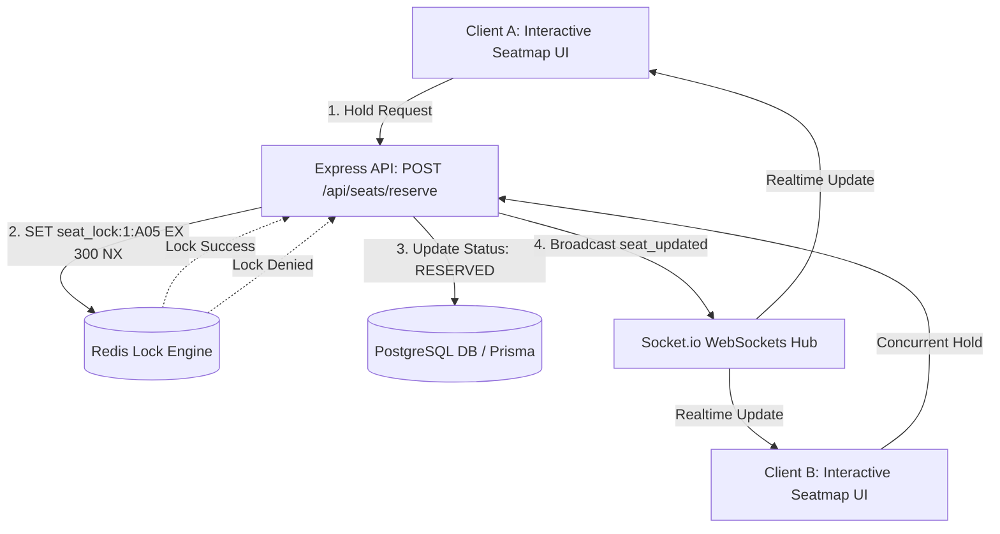

# Ticket Real-time Hub (Node.js & TypeScript WebSockets)

> **Atomic Seat Hold & Real-time Inventory Synchronization Engine**  
> *A high-performance Node.js service built with Express, TypeScript, Socket.io, Redis, and Prisma ORM to prevent double-reservation of travel seats.*

[](https://nodejs.org)
[](https://typescriptlang.org)
[](https://socket.io)
[](https://redis.io)
[](https://postgresql.org)

---

## 📌 Origin & Technical Motivation

**Ticket Real-time Hub** is an **original technical extension** designed to solve temporary seat holds and real-time inventory synchronization in ticketing platforms. 

When thousands of users view the same bus/train/flight seat map simultaneously, standard database queries create severe race conditions. This engine introduces an **atomic, non-blocking Redis hold mechanism** paired with **WebSockets** to broadcast seat updates instantly, pairing directly with backend systems such as [`travel-distribution-core`](../travel-distribution-core/).

---

## ⚙️ Core Architecture & Engineering Highlights



1. **Atomic Redis Distributed Locks (`SET EX NX`)**
   Guarantees that a seat cannot be held by two concurrent users. Locks are acquired in Redis using `SET seat_lock:ticketId:seatNumber userId EX 300 NX`. If the key exists, the reservation fails instantly with zero DB contention.
2. **Lazy Expiry Cleanup Strategy**
   Avoids expensive, continuous background polling timers. When a client requests a seat map, the service compares currently `reserved` seats against active Redis keys. If a Redis lock key has expired, the database status is lazily updated back to `available`.
3. **Real-time WebSockets Synchronization**
   Uses **Socket.io** to broadcast seat status changes (`reserved`, `available`, `booked`) to all connected client seat maps immediately.
4. **Clean Layered Architecture**
   Organized with strict separation of concerns (`routes`, `controllers`, `services`, `prisma models`).

---

## 🚀 Quick Start (3-Minute Local Setup)

### Prerequisites
* [Docker Desktop](https://www.docker.com/products/docker-desktop/) installed.

### 1-Command Build & Run

```bash
# 1. Clone the repository and navigate into it
git clone https://github.com/huyhhuy1410/ticket-realtime-hub.git
cd ticket-realtime-hub

# 2. Copy the environment variables
cp .env.example .env

# 3. Spin up multi-container environment (Node.js, PostgreSQL, Redis)
docker compose up -d --build

# 4. Push Prisma database schema to PostgreSQL
docker exec -it ticket_realtime_app npx prisma db push
```

✅ **Success Signal:** Open your browser at `http://localhost:3000` to interact with the live glassmorphic seat selection UI!

---

## 🧪 Interactive API & Walkthrough

### 1. Request a Seat Reservation (Atomic Lock)
Simulate user `22` locking seat `A05` on Ticket `1`:
```bash
curl -X POST http://localhost:3000/api/seats/reserve \
     -H "Content-Type: application/json" \
     -d '{"ticketId": 1, "seatNumber": "A05", "userId": 22}'
```
*Response:* `200 OK` — Seat `A05` status changes to `reserved` with a 5-minute Redis TTL lock created.

### 2. Attempt Duplicate Reservation (Conflict Test)
Simulate user `99` trying to lock the same seat `A05`:
```bash
curl -X POST http://localhost:3000/api/seats/reserve \
     -H "Content-Type: application/json" \
     -d '{"ticketId": 1, "seatNumber": "A05", "userId": 99}'
```
*Response:* `409 Conflict` — *"Seat is currently held by another user."*

### 3. Confirm Booking (Laravel Payment Webhook Callback)
Simulate the payment confirmation callback from Laravel backend:
```bash
curl -X POST http://localhost:3000/api/seats/confirm \
     -H "Content-Type: application/json" \
     -d '{"ticketId": 1, "seatNumber": "A05"}'
```
*Response:* `200 OK` — Seat status becomes `booked`, Redis lock is released, and all open browser UIs update instantly via Socket.io.

---

## 📂 Project Directory Structure

```text
ticket-realtime-hub/
├── src/
│   ├── controllers/   # HTTP handlers for seat actions & callbacks
│   ├── services/      # Redis lock logic (EX, NX), Prisma queries & lazy cleanup
│   ├── routes/        # Express REST route definitions
│   └── server.ts      # Server entry point initializing Express, Socket.io, & Prisma
├── prisma/            # PostgreSQL database schema
├── views/             # EJS interactive seat-map dashboard
├── public/            # Client-side Socket.io & Axios handlers
└── docker-compose.yml # Container orchestration for Node, Postgres, & Redis
```

---

## 🤝 Contributing

Contributions, bug reports, and feature proposals are welcome! Feel free to open an issue or submit a Pull Request.

---

## 📄 License & Provenance Notice

This repository is an **independent technical project** created by Vo Quang Huy for technical demonstration. It contains no proprietary code, private client data, or credentials from third-party employers.
